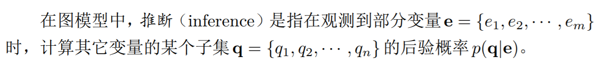
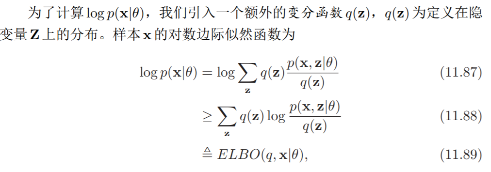
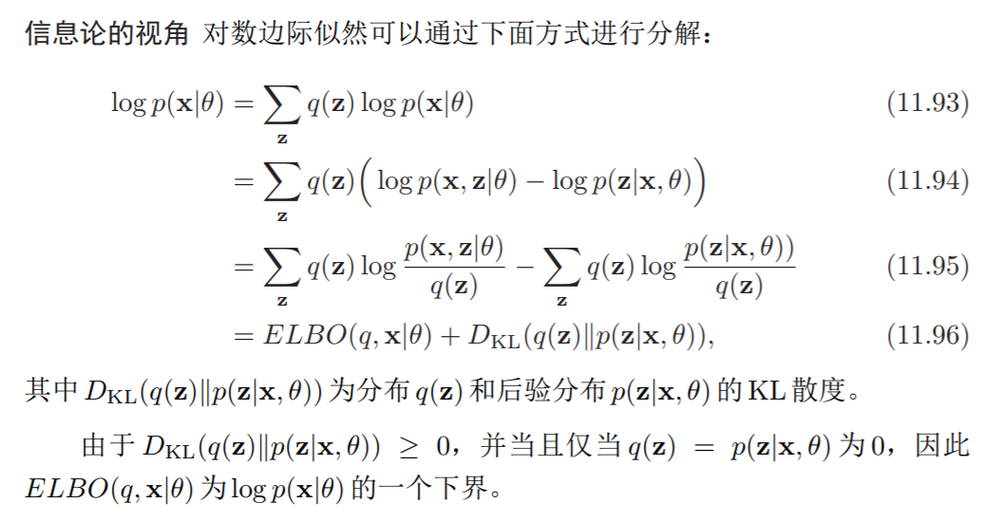
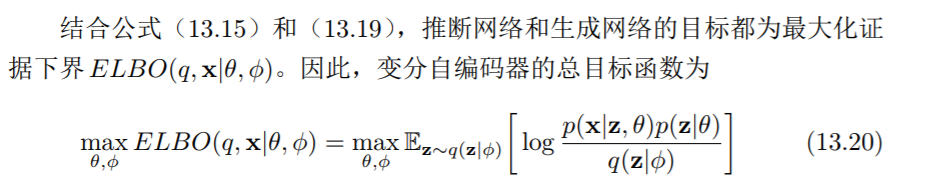
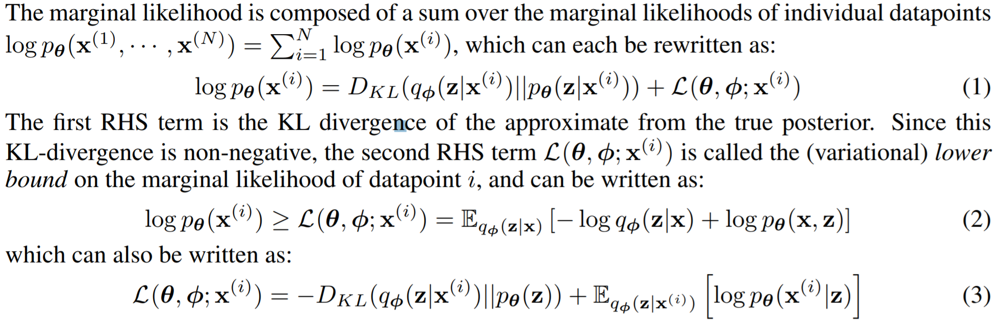

# Poster session. Notes.

## 1. 术语

- **隐变量(latent variables)，推断(inference)**：

  **[概率图模型](https://nndl.github.io/chap-%E6%A6%82%E7%8E%87%E5%9B%BE%E6%A8%A1%E5%9E%8B.pdf)**

  + **推断问题**

    

  + **隐变量** ：图模型中不可观测的变量。

- [混合高斯模型，隐变量$z$与$x$](http://cs229.stanford.edu/notes/cs229-notes7b.pdf)

  [Jensen不等式，EM Algorithm]( http://cs229.stanford.edu/notes/cs229-notes8.pdf )

  [含有隐变量的参数估计问题(11.4)](https://nndl.github.io/chap-%E6%A6%82%E7%8E%87%E5%9B%BE%E6%A8%A1%E5%9E%8B.pdf)

+ **EM Algorithm:** 一种概率密度估计方法。

  估计参数 $\rightarrow$ 最大化训练集的边际似然 $\rightarrow$  Jensen不等式等号成立的条件为$q(\mathbb{z})=p(\mathbb{z|x};\theta)$. 即EM算法中E的最优解。

  + **变分函数$q$**

       

     

  - **KL散度：量化两个分布的差异**

    

  - **变分下界(variational lower bound) = ELBO**

    变分自编码器可以视作是EM算法，E, M两步的目标在VAE中统一起来：

    

- **Auto-Encoders**：自动编码器，一种数据压缩的方法

  - [Autoencoder Stanford Tutorial](http://ufldl.stanford.edu/tutorial/unsupervised/Autoencoders/)

  - [From Autoencoders to Variational Autoencoders](https://m.leiphone.com/news/201803/mtEH19MnLZzoPSL2.html) （**变分自编码器用处，为什么建立一个从$\mathbb{x}$到$\mathbb{x}$的神经网络** ）

    **隐变量是encoder的输出，即原始数据压缩后的表示。** 

- **随机梯度下降，反向传播**(Stochastic Gradient Descent, Backward Propagation)

  [batch梯度下降，随机梯度下降](http://cs229.stanford.edu/notes/cs229-notes1.pdf)

  神经网络建立以后，其参数通过优化目标函数得到；梯度下降是一种优化方法，利用(误差)反向传播可以在神经网络上实现梯度下降。

## 2. 论文解决的问题：估计$\theta $，观测$z$

假设数据$x$的生成由从$p_\theta(z)$中抽取的$z$按照$p_\theta(x|z)$的分布抽取获得，我们想知道$\theta, z$，现在有观测集合$X = \{x^i\}_{i=1}^{N}$。

+ **Problem Scenerio**:
  + E步的最优解：$q(z)=p(z|x,\theta)=p(x|z;\theta)p(z;\theta)/p(x;\theta)$，其中$p(x;\theta)=\int p(z;\theta)p(x|z;\theta)dz$无法计算，所以不能够用EM Algorithm 解决。

  + 大数据集，batch optimization优化非常麻烦。
+ **solving following 3 Problems**
  + 近似ML和MAP估计参数, 这些参数在某些自然过程(natural processes)中很重要；还可以模拟隐变量的随机过程，生成与原来的数据相似的人工数据。
  + 给定$\theta$和$x$后，可以近似$z$的后验分布。
  + 近似$x$的边缘推断，可以用于**降噪**。

要估计$\theta$ ，采用极大似然估计的方法，但是需要在对数函数函数中求和，因此引入$q(z)$，使用$Jensen$不等式得到变分下界，注意到$Jensen$不等式的等号成立条件为：$q_\phi(z)=p(z|x;\theta)$，此项由方程(1)中的KL散度描述，当$q_\phi(z)=p(z|x;\theta)$成立时， $D_{KL}(q||p)=0$，也即：似然函数等于变分下界。

。

+ **变分下界**

  单个样本的似然：

  $log(p_\theta(x^{(i)}))$

  

  似然函数 $\geq$ 变分下界，类似EM算法，希望最大化变分下界，但是$\nabla_\phi E_{q_\phi (z|x^{(i)})}$不易求得，上式中$D_{KL}$与$\phi$有关，相当于$E$，$E_q$与$\theta$有关，相当于$M$，得到$\theta$，就可以得到$p(x|z;\theta)$，求出$\phi$以后可以观测到隐变量。

+ **SGVB estimator and AEVB**：

  + **SGVB**: 每一次epoch, 仅仅使用数据中的小部分(M)来估计总体的似然。

  + **再参数化：**  

    $q_\phi(z|x) \rightarrow \tilde z = g_\phi(\epsilon, x)$， 似然$L\rightarrow \tilde L$， $\tilde L$可以计算$\nabla_\phi \tilde L$ 

+ **算法：**

	repeat
		1. 从N中抽样M个
		2. 再参数化：生成epsilon, 生成z
		3. 计算梯度
		4. 梯度优化
	until convergence
## 3. 举例： 变分自动编码器

假设：

$p(z)=N(z; 0,I)$

$p_\theta(x|z)=Bernolli/Gaussian ​$， 其参数为生成网络的输出。

$q_\phi(z|x)=N(z; \mu, \sigma^2I)$， 其参数为推断网络的输出。

再参数化策略：

​	$z^{i,l} = g(\epsilon, x) = \mu^{i} + \sigma^i * \epsilon^l$

+ **实验**

  VAE估计出来的似然下界远远大于wake-sleep method.

  VAE的边际似然大于其余方法，且收敛更快。

